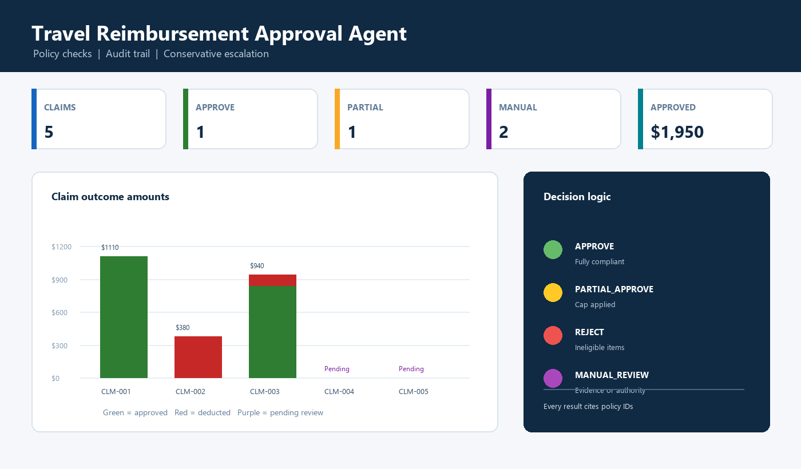

# Travel Reimbursement Approval Agent

<div align="center">
  
</div>

<div align="center">
  
  
  
</div>

## Overview

A runnable prototype for reviewing employee travel reimbursement claims against policy, receipts, spending limits, timeliness, and approval authority. The implementation evaluates the five claims supplied in the assignment brief and produces an auditable structured recommendation for each one.

**Primary deliverable:** [`VarshithaGundluru.ipynb`](./VarshithaGundluru.ipynb)

## Why this solution is strong

- **Policy-grounded:** monetary limits and decision gates are encoded as inspectable tools with stable `POL-*` references.
- **Agentic:** a planner selects tools from claim contents; an optional Groq-compatible LLM planner is available with a deterministic fallback.
- **Reliable:** input validation, exact schema validation, assertions, and conservative manual-review routing are included.
- **Auditable:** every claim retains tool evidence, policy references, missing-document findings, and the reasoning behind escalation.
- **Reviewer-friendly:** the notebook includes sample outputs, dashboard KPIs, a static screenshot, and an optional interactive claim explorer.

## Workflow

```text
JSON claim intake
      ↓
Input validation + policy retrieval
      ↓
Eligibility | receipts | airfare | timeliness | caps | approval threshold
      ↓
Decision synthesis with manual-review gates
      ↓
Exact JSON schema validation + audit trail + dashboard
```

## Decision outcomes

| Claim | Decision | Approved | Deducted | Primary reason |
|---|---|---:|---:|---|
| CLM-001 | `APPROVE` | $1,110.00 | $0.00 | Fully compliant manager-tier claim |
| CLM-002 | `REJECT` | $0.00 | $380.00 | Spa and minibar are ineligible |
| CLM-003 | `PARTIAL_APPROVE` | $840.00 | $100.00 | Lodging exceeds the two-night cap |
| CLM-004 | `MANUAL_REVIEW` | Pending | Pending | Business airfare, missing receipt, high value |
| CLM-005 | `MANUAL_REVIEW` | Pending | Pending | Required meal receipt is missing |

For manual-review cases, the notebook reports `$0.00` approved and `$0.00` deducted until a reviewer resolves the evidence. This avoids treating a pending amount as a finalized payment decision.

## Tools

1. `validate_claim_input` — checks required fields, dates, and amounts.
2. `lookup_policy` — retrieves relevant policy IDs and context.
3. `check_category_eligibility` — identifies eligible, ineligible, and ambiguous categories.
4. `check_receipt_completeness` — applies receipt requirements and records missing documents.
5. `check_airfare_compliance` — routes business/first-class airfare to review.
6. `check_submission_timeliness` — checks the 30-day submission window.
7. `check_per_diem_limits` — applies meal, lodging, and ground-transport caps.
8. `check_approval_threshold` — applies auto-approve, manager, and director tiers.

## Run the demo

Open the notebook in Jupyter, JupyterLab, or VS Code and run all cells from top to bottom.

```bash
jupyter notebook VarshithaGundluru.ipynb
```

No API key is required for the deterministic workflow. For the optional LLM planner, install no extra package—the notebook uses Python’s standard library HTTP client—then set:

Windows:

```cmd
set GROQ_API_KEY=your_key_here
```

macOS/Linux:

```bash
export GROQ_API_KEY=your_key_here
```

Finally, set `ENABLE_LLM_TOOL_PLANNER = True` in the configuration cell. The LLM proposal is restricted to known tools and cannot bypass required safety checks. Never commit API keys.

Optional dashboard dependencies:

```bash
pip install pandas matplotlib ipywidgets
```

If optional packages are unavailable, the notebook still runs its deterministic checks and prints numeric dashboard KPIs.

## Required final output

The final notebook cell prints a JSON array with exactly these fields:

```text
claim_id, decision, approved_amount, deducted_amount, missing_docs,
policy_refs, confidence, explanation, tools_used
```

## Repository structure

```text
.
├── VarshithaGundluru.ipynb
├── UI_SS_1.png
├── README.md
└── .gitignore
```

## Design notes and trade-offs

The policy engine is deterministic because reimbursement amounts and escalation rules should be reproducible. GenAI is optional and limited to tool planning; this keeps the financial decision grounded even when a model is unavailable or uncertain. The prototype uses mock claims and an in-memory policy rather than production integrations.

## Limitations and next steps

- Add receipt OCR, duplicate detection, and historical-claim checks.
- Move policy rules into a versioned source of truth with effective dates.
- Add human-review capture and approval feedback loops.
- Add persistent audit storage, observability, and policy-change monitoring.
- Add a full evaluation suite with adversarial and ambiguous claims.

## Author

**Varshitha Gundluru**

[GitHub](https://github.com/VarshithaGundluru) · [LinkedIn](https://www.linkedin.com/in/varshitha-g-89a9a1314/)